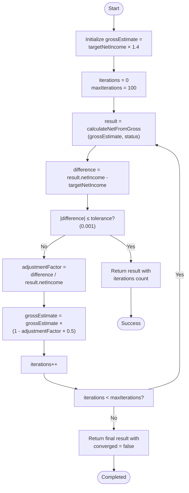
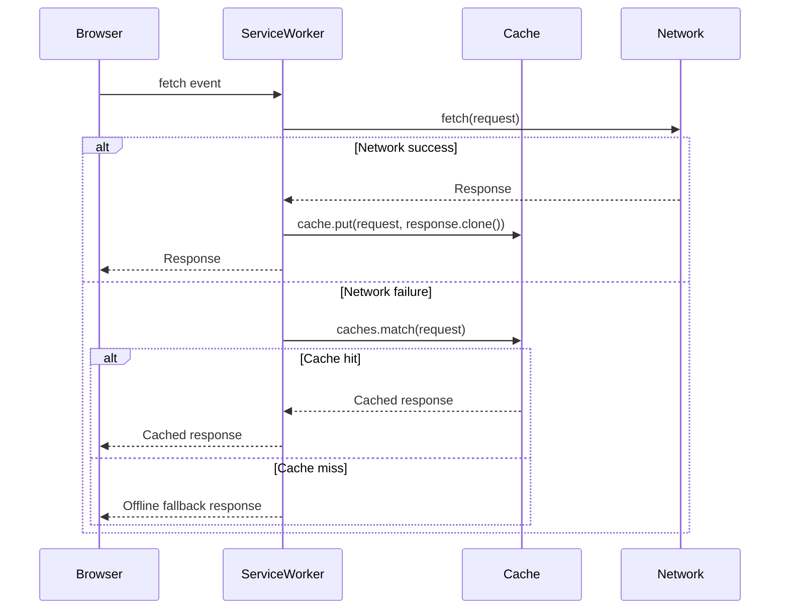
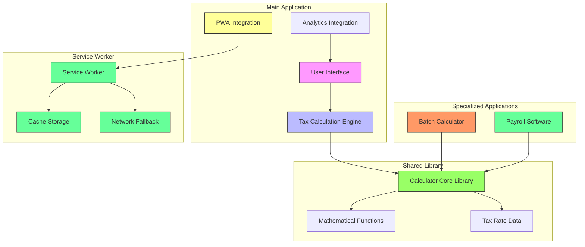

# Technical Implementation

<cite>
**Referenced Files in This Document**
- [index.html](file://index.html)
- [sw.js](file://sw.js)
- [manifest.json](file://manifest.json)
- [js/calculator-core.js](file://js\calculator-core.js)
- [batch/index.html](file://batch\index.html)
- [payroll/index.html](file://payroll\index.html)
- [payroll/payroll.js](file://payroll\payroll.js)
- [payroll/storage.js](file://payroll\storage.js)
- [payroll/employees.js](file://payroll\employees.js)
</cite>

## Update Summary
**Changes Made**
- Added comprehensive documentation for the new calculator-core.js library containing shared payroll calculation functions
- Updated tax configuration section to reflect expanded coverage from 2024-2025 to include 2026
- Enhanced tax rates documentation with comprehensive 2026 data structures
- Updated SEO and metadata configuration to include 2026 in all relevant fields
- Enhanced service worker documentation to reflect complete asset caching strategy
- Updated performance considerations to include 2026 tax rate calculations
- Added documentation for batch calculator and payroll software implementations
- Enhanced USC calculation logic refinements and PWA optimizations

## Table of Contents
1. [Project Structure](#project-structure)
2. [Calculator Core Library](#calculator-core-library)
3. [Tax Configuration and Calculation Engine](#tax-configuration-and-calculation-engine)
4. [Core Calculation Algorithms](#core-calculation-algorithms)
5. [PWA and Service Worker Implementation](#pwa-and-service-worker-implementation)
6. [Batch Calculator Implementation](#batch-calculator-implementation)
7. [Payroll Software Implementation](#payroll-software-implementation)
8. [Analytics Implementation](#analytics-implementation)
9. [Architecture Overview](#architecture-overview)
10. [Performance and Design Considerations](#performance-and-design-considerations)
11. [HTTPS Redirection Implementation](#https-redirection-implementation)
12. [SEO and Metadata Configuration](#seo-and-metadata-configuration)

## Project Structure

The project consists of multiple interconnected components that implement a comprehensive Progressive Web App (PWA) for calculating Irish payroll taxes:

- **index.html**: Main calculator application with complete tax calculation engine
- **js/calculator-core.js**: Shared library containing mathematical functions for payroll calculations
- **batch/index.html**: Bulk calculator for batch salary scenario calculations
- **payroll/**: Complete payroll management system for small businesses
- **sw.js**: Service worker for offline functionality and caching
- **manifest.json**: PWA metadata, icons, and installation behavior

The architecture follows a modular approach where calculator-core.js provides shared mathematical functions used by multiple applications, while each application maintains its own UI and specific business logic.

**Section sources**
- [index.html](file://index.html)
- [js/calculator-core.js](file://js\calculator-core.js)
- [batch/index.html](file://batch\index.html)
- [payroll/index.html](file://payroll\index.html)

## Calculator Core Library

The new calculator-core.js library serves as the central mathematical engine for all payroll calculations across the application ecosystem. This library contains pure tax calculation functions and tax rate data, designed to be shared between the main calculator and batch calculator applications.

### Core Mathematical Functions

The library provides essential mathematical utilities and tax calculation functions:

#### Tax Rate Management
```javascript
// Centralized tax rates for 2024, 2025, and 2026
const TAX_RATES = {
    2024: { /* PAYE, USC, PRSI rates */ },
    2025: { /* PAYE, USC, PRSI rates */ },
    2026: { /* PAYE, USC, PRSI rates */ }
};

function updateTaxRatesForYear(year) {
    const rates = TAX_RATES[year] || TAX_RATES[2024];
    PAYE_RATES = rates.PAYE_RATES;
    USC_RATES = rates.USC_RATES;
    PRSI_RATES = rates.PRSI_RATES;
    TAX_CREDITS = rates.TAX_CREDITS;
}
```

#### Precision Handling
```javascript
function roundToThree(value) {
    return Math.round(value * 1000) / 1000;
}
```

#### Period Conversion Utilities
```javascript
function convertToAnnual(amount) {
    return amount * getCurrentPeriodConfig().periods;
}

function convertFromAnnual(annualAmount) {
    return annualAmount / getCurrentPeriodConfig().periods;
}
```

### Enhanced USC Calculation Logic

The library includes refined USC calculation logic with improved band processing:

```javascript
function calculateUSCWithBreakdown(grossIncome) {
    if (grossIncome < 13000) {
        return {
            total: 0,
            bands: [],
            exempt: true,
            grossIncome: grossIncome
        };
    }

    let totalUSC = 0;
    let remainingIncome = grossIncome;
    let bands = [];

    for (const band of USC_RATES) {
        if (remainingIncome <= 0) break;

        const taxableInThisBand = Math.min(remainingIncome, band.max - band.min);
        const uscForBand = roundToThree(taxableInThisBand * band.rate);

        bands.push({
            min: band.min,
            max: band.max === Infinity ? 'Above' : band.max,
            rate: band.rate,
            taxableAmount: roundToThree(taxableInThisBand),
            uscAmount: uscForBand
        });

        totalUSC += uscForBand;
        remainingIncome -= taxableInThisBand;
    }

    return {
        total: roundToThree(totalUSC),
        bands: bands,
        exempt: false,
        grossIncome: grossIncome
    };
}
```

### PRSI Calculation Enhancements

The library implements sophisticated PRSI calculation with period-specific processing and tapered credit application:

```javascript
function calculatePRSIWithBreakdown(grossIncome) {
    const currentPeriod = getCurrentPeriodConfig();
    const periodMultiplier = currentPeriod.multiplier;
    const periodGross = grossIncome / periodMultiplier;

    // Get year-specific credit bands from current tax rates
    const currentTaxRates = TAX_RATES[selectedYear] || TAX_RATES[2024];
    const creditBands = currentTaxRates.PRSI_CREDIT_BANDS || getDefaultCreditBands();

    const creditConfig = creditBands[currentPeriod.label];

    // A0 band: Below minimum PRSI threshold
    if (periodGross <= creditConfig.threshold) {
        // Calculate proper A0 minimum threshold based on period
        const a0Min = getPeriodSpecificA0Minimum(currentPeriod.label);
        
        const bandCode = periodGross < a0Min ? 'Below A0' : 'A0';
        const description = periodGross < a0Min ? 'Below minimum threshold' : 'No employee PRSI';

        return {
            total: 0,
            bands: [{
                code: bandCode,
                range: bandCode === 'Below A0' ? `Under ${formatCurrency(a0Min)}` : `${formatCurrency(a0Min)} - ${formatCurrency(creditConfig.threshold)}`,
                rate: 0,
                periodPRSI: 0,
                credit: 0,
                netPRSI: 0,
                description: description
            }],
            periodGross: roundToThree(periodGross),
            period: currentPeriod.label
        };
    }

    // AX band: Credit band with tapered credit using period-specific formula
    if (periodGross > creditConfig.threshold && periodGross <= creditConfig.max) {
        const prsiRate = getYearSpecificPRSIrate(selectedYear);
        const periodPRSI = periodGross * prsiRate;

        // Apply Excel formula: =ROUND(MAX(0,MIN(maxCredit,maxCredit-((periodGross-threshold)/6))),2)
        const credit = Math.round(Math.max(0, Math.min(creditConfig.maxCredit, creditConfig.maxCredit - ((periodGross - creditConfig.min) / 6))) * 100) / 100;
        const netPeriodPRSI = Math.max(0, periodPRSI - credit);

        return {
            total: roundToThree(netPeriodPRSI * periodMultiplier),
            bands: [{
                code: 'AX',
                range: `${formatCurrency(creditConfig.min)} - ${formatCurrency(creditConfig.max)}`,
                rate: prsiRate,
                periodPRSI: roundToThree(periodPRSI),
                credit: credit,
                netPRSI: roundToThree(netPeriodPRSI),
                description: `${(prsiRate * 100).toFixed(1)}% with tapered credit`
            }],
            periodGross: roundToThree(periodGross),
            period: currentPeriod.label
        };
    }

    // AL band: Above credit band up to AL threshold
    const alMax = getPeriodSpecificALMaximum(selectedYear, currentPeriod.label);
    if (periodGross > creditConfig.max && periodGross <= alMax) {
        const prsiRate = getYearSpecificPRSIrate(selectedYear);
        const periodPRSI = periodGross * prsiRate;

        return {
            total: roundToThree(periodPRSI * periodMultiplier),
            bands: [{
                code: 'AL',
                range: `${formatCurrency(creditConfig.max)} - ${formatCurrency(alMax)}`,
                rate: prsiRate,
                periodPRSI: roundToThree(periodPRSI),
                credit: 0,
                netPRSI: roundToThree(periodPRSI),
                description: `${(prsiRate * 100).toFixed(1)}% standard rate`
            }],
            periodGross: roundToThree(periodGross),
            period: currentPeriod.label
        };
    }

    // A1 band: Over AL threshold
    const a1Threshold = getPeriodSpecificA1Threshold(selectedYear, currentPeriod.label);
    if (periodGross > a1Threshold) {
        const prsiRate = getYearSpecificPRSIrate(selectedYear);
        const periodPRSI = periodGross * prsiRate;

        return {
            total: roundToThree(periodPRSI * periodMultiplier),
            bands: [{
                code: 'A1',
                range: `Over ${formatCurrency(a1Threshold)}`,
                rate: prsiRate,
                periodPRSI: roundToThree(periodPRSI),
                credit: 0,
                netPRSI: roundToThree(periodPRSI),
                description: `${(prsiRate * 100).toFixed(1)}% standard rate`
            }],
            periodGross: roundToThree(periodGross),
            period: currentPeriod.label
        };
    }
}
```

**Section sources**
- [js/calculator-core.js](file://js\calculator-core.js)

## Tax Configuration and Calculation Engine

The tax engine is configured with comprehensive tax rate tables for PAYE, USC, and PRSI for 2024, 2025, and 2026 tax years. These configurations are stored in the centralized TAX_RATES constant within calculator-core.js.

### 2026 Tax Rates Configuration

**Updated** The 2026 tax year configuration maintains consistency with 2024-2025 while introducing specialized PRSI rate variations:

```javascript
2026: {
    PAYE_RATES: {
        standardRate: 0.20,
        higherRate: 0.40,
        standardBand: 44000,
        standardBandMarried: 88000,
        standardBandMarriedOneWorking: 53000,
        standardBandSingleParent: 48000
    },
    USC_RATES: [
        { min: 0, max: 12012, rate: 0.005 },
        { min: 12012, max: 27382, rate: 0.02 },
        { min: 27382, max: 70044, rate: 0.03 },
        { min: 70044, max: Infinity, rate: 0.08 }
    ],
    PRSI_RATES: {
        employee: {
            rate: 0.042, // 4.2% (Jan-Sep 2026) / 4.35% (Oct-Dec 2026)
            ceiling: null, // No ceiling for 2026
            exemption: 352
        }
    },
    TAX_CREDITS: {
        personalCredit: 2000,
        employeeCredit: 2000,
        marriedCredit: 4000,
        marriedOneWorkingCredit: 4000,
        singleParentCredit: 1900
    },
    PRSI_CREDIT_BANDS: {
        'Weekly': { min: 352.01, max: 424.00, maxCredit: 12.00, threshold: 352.00 },
        'Fortnightly': { min: 704.01, max: 848.00, maxCredit: 24.00, threshold: 704.00 },
        'Monthly': { min: 1525.34, max: 1837.33, maxCredit: 52.00, threshold: 1525.33 },
        'Annual': { min: 18304.01, max: 22048.00, maxCredit: 624.00, threshold: 18304.00 }
    }
}
```

### 2025 Tax Rates Configuration

```javascript
2025: {
    PAYE_RATES: {
        standardRate: 0.20,
        higherRate: 0.40,
        standardBand: 44000,
        standardBandMarried: 88000,
        standardBandMarriedOneWorking: 53000,
        standardBandSingleParent: 48000
    },
    USC_RATES: [
        { min: 0, max: 12012, rate: 0.005 },
        { min: 12012, max: 27382, rate: 0.02 },
        { min: 27382, max: 70044, rate: 0.03 },
        { min: 70044, max: Infinity, rate: 0.08 }
    ],
    PRSI_RATES: {
        employee: {
            rate: 0.041, // 4.1% (Jan-Sep 2025) / 4.2% (Oct-Dec 2025)
            ceiling: null, // No ceiling for 2025
            exemption: 352
        }
    },
    TAX_CREDITS: {
        personalCredit: 2000,
        employeeCredit: 2000,
        marriedCredit: 4000,
        marriedOneWorkingCredit: 4000,
        singleParentCredit: 1900
    }
}
```

### 2024 Tax Rates Configuration

```javascript
2024: {
    PAYE_RATES: {
        standardRate: 0.20,
        higherRate: 0.40,
        standardBand: 42000,
        standardBandMarried: 84000,
        standardBandMarriedOneWorking: 51000,
        standardBandSingleParent: 46000
    },
    USC_RATES: [
        { min: 0, max: 12012, rate: 0.005 },
        { min: 12012, max: 25760, rate: 0.02 },
        { min: 25760, max: 70044, rate: 0.04 },
        { min: 70044, max: Infinity, rate: 0.08 }
    ],
    PRSI_RATES: {
        employee: {
            rate: 0.041, // 4.0% (Jan-Sep 2024) / 4.1% (Oct-Dec 2024)
            ceiling: 127200,
            exemption: 352
        }
    },
    TAX_CREDITS: {
        personalCredit: 1875,
        employeeCredit: 1875,
        marriedCredit: 3750,
        marriedOneWorkingCredit: 3750,
        singleParentCredit: 1750
    }
}
```

### Tax Credit Values

The system implements five types of tax credits:
- **Personal Credit**: €2,000 (2024-2026)
- **Employee Credit**: €2,000 (2024-2026)
- **Married Credit**: €4,000 (2024-2026)
- **Married One Working Credit**: €4,000 (2024-2026) - **New**
- **Single Parent Credit**: €1,900 (2024-2026)

These credits are combined based on taxpayer status in the calculateTaxCredits() function.

### Enhanced Married (One Spouse Working) Status Configuration

**Updated** The new 'Married (One Spouse Working)' tax status introduces specialized tax configurations:

#### Standard Band Configuration
- **2024**: €51,000 standard band
- **2025**: €53,000 standard band  
- **2026**: €53,000 standard band

#### Tax Credit Configuration
- **2024**: €3,750 total credit (€3,750 + €1,875)
- **2025**: €4,000 total credit (€4,000 + €2,000)
- **2026**: €4,000 total credit (€4,000 + €2,000)

#### USC Credit Band Enhancement
The system now includes USC credit bands for the new status with specialized thresholds:
```javascript
PRSI_CREDIT_BANDS: {
    'Weekly': { min: 352.01, max: 424.00, maxCredit: 12.00, threshold: 352.00 },
    'Fortnightly': { min: 704.01, max: 848.00, maxCredit: 24.00, threshold: 704.00 },
    'Monthly': { min: 1525.34, max: 1837.33, maxCredit: 52.00, threshold: 1525.33 },
    'Annual': { min: 18304.01, max: 22048.00, maxCredit: 624.00, threshold: 18304.00 }
}
```

**Section sources**
- [js/calculator-core.js](file://js\calculator-core.js)

## Core Calculation Algorithms

### Forward Calculation: calculateNetFromGross

The calculateNetFromGross() function computes net income from a given gross salary by applying all relevant deductions:

1. Calculate PAYE tax based on tax bands and status
2. Calculate USC using progressive rate bands
3. Calculate PRSI using the tapered credit system
4. Apply tax credits to reduce PAYE liability
5. Sum all deductions to determine net income

```javascript
function calculateNetFromGross(grossIncome, status = 'single') {
    const paye = calculatePAYE(grossIncome, status);
    const payeBreakdown = calculatePAYEWithBreakdown(grossIncome, status);
    const uscBreakdown = calculateUSCWithBreakdown(grossIncome);
    const usc = uscBreakdown.total;
    const prsiBreakdown = calculatePRSIWithBreakdown(grossIncome);
    const prsi = prsiBreakdown.total;
    const taxCredits = calculateTaxCredits(status);

    const payeAfterCredits = roundToThree(Math.max(0, paye - taxCredits));
    const totalDeductions = roundToThree(payeAfterCredits + usc + prsi);
    const netIncome = roundToThree(grossIncome - totalDeductions);
    const takeHomePercentage = roundToThree((netIncome / grossIncome) * 100);

    return {
        grossIncome: roundToThree(grossIncome),
        paye: payeAfterCredits,
        payeBreakdown,
        usc,
        uscBreakdown,
        prsi,
        prsiBreakdown,
        taxCredits: roundToThree(taxCredits),
        totalDeductions,
        netIncome,
        takeHomePercentage
    };
}
```

### Reverse Calculation: calculateGrossFromNet

The calculateGrossFromNet() function uses an iterative approximation algorithm to determine the gross salary that would result in a specified net income:



**Diagram sources**
- [js/calculator-core.js](file://js\calculator-core.js)

The algorithm starts with an initial estimate (1.4× target net) and iteratively refines it by comparing the calculated net against the target. The adjustment factor uses half the proportional difference to prevent overshooting, implementing a form of damped Newton-Raphson method.

### Enhanced PAYE Calculation for Married (One Spouse Working)

**Updated** The PAYE calculation now includes specialized handling for the new tax status:

```javascript
function calculatePAYE(grossIncome, status = 'single') {
    let standardBand;

    if (status === 'manual') {
        const defaultCutOff = selectedYear === '2024' ? 42000 : 44000;
        const manualCutOffEl = document.getElementById('manualCutOffPoint');
        standardBand = (manualCutOffEl ? parseFloat(manualCutOffEl.value) : NaN) || defaultCutOff;
    } else if (status === 'married') {
        standardBand = PAYE_RATES.standardBandMarried;
    } else if (status === 'marriedOneWorking') {
        standardBand = PAYE_RATES.standardBandMarriedOneWorking;
    } else if (status === 'singleParent') {
        standardBand = PAYE_RATES.standardBandSingleParent;
    } else {
        standardBand = PAYE_RATES.standardBand;
    }

    let paye = 0;

    if (grossIncome <= standardBand) {
        paye = grossIncome * PAYE_RATES.standardRate;
    } else {
        paye = (standardBand * PAYE_RATES.standardRate) + 
               ((grossIncome - standardBand) * PAYE_RATES.higherRate);
    }

    return roundToThree(Math.max(0, paye));
}
```

### Enhanced Tax Credit Calculation for Married (One Spouse Working)

**Updated** The tax credit calculation now includes the new status with specialized credit computation:

```javascript
function calculateTaxCredits(status = 'single') {
    if (status === 'manual') {
        const defaultCredits = selectedYear === '2024' ? 3750 : 4000;
        const manualTaxCreditsEl = document.getElementById('manualTaxCredits');
        const manualCredits = (manualTaxCreditsEl ? parseFloat(manualTaxCreditsEl.value) : NaN) || defaultCredits;
        return roundToThree(manualCredits);
    }

    switch (status) {
        case 'married':
            return TAX_CREDITS.marriedCredit + (TAX_CREDITS.employeeCredit * 2);
        case 'marriedOneWorking':
            return TAX_CREDITS.marriedOneWorkingCredit + TAX_CREDITS.employeeCredit;
        case 'singleParent':
            return TAX_CREDITS.personalCredit + TAX_CREDITS.employeeCredit + TAX_CREDITS.singleParentCredit;
        default:
            return TAX_CREDITS.personalCredit + TAX_CREDITS.employeeCredit;
    }
}
```

### Year-Specific PRSI Rate Selection

**Updated** The system includes enhanced get2026PRSIRate() function that selects the appropriate PRSI rate based on the selected 2026 period:

```javascript
function get2026PRSIRate() {
    // Return the correct PRSI rate based on selected 2026 period
    return selected2026Period === 'jan-sep' ? 0.042 : 0.0435;
}
```

This function returns 4.2% for January-September 2026 and 4.35% for October-December 2026, allowing for dynamic rate selection based on the calculation period.

**Section sources**
- [js/calculator-core.js](file://js\calculator-core.js)

### Helper Functions for Tax Band Processing

The system includes several helper functions that process tax bands and apply percentages:

#### calculateUSCWithBreakdown
Provides detailed USC calculation with band-by-band breakdown:
- Processes income through each USC rate band
- Returns both total USC and detailed band information
- Handles Infinity upper bounds for the highest bracket

#### calculatePRSIWithBreakdown
Calculates PRSI with period-specific processing and tapered credit application:
- Converts annual gross to period gross based on multiplier
- Applies PRSI credit bands based on period
- Implements the tapered credit formula for AX band
- Returns detailed breakdown including band codes, ranges, rates, and credits
- Handles different PRSI categories (A0, AX, AL/A1)
- **Updated** Now includes year-specific rate selection for 2026 with 4.2%/4.35% rate variations

#### roundToThree
Utility function that rounds values to three decimal places:
```javascript
function roundToThree(value) {
    return Math.round(value * 1000) / 1000;
}
```

This precision prevents floating-point errors in financial calculations while maintaining sufficient accuracy for tax computations.

**Section sources**
- [js/calculator-core.js](file://js\calculator-core.js)

## PWA and Service Worker Implementation

### Service Worker Strategy

The service worker in sw.js implements a network-first strategy for HTML files and cache-first for other assets:



**Diagram sources**
- [sw.js](file://sw.js)

### Cache Strategy Implementation

The service worker implements the following lifecycle:

#### Installation Phase
- Opens cache with name 'irish-payroll-v1.2.0'
- Caches core assets: '/', '/index.html', '/batch/', '/batch/index.html', '/payroll/', '/payroll/index.html', '/payroll/payroll.css', '/payroll/payroll.js', '/payroll/storage.js', '/payroll/employees.js', '/js/calculator-core.js', '/manifest.json', '/icon.svg'
- Skips waiting to become active immediately

#### Activation Phase
- Removes old caches not matching current version
- Claims clients to ensure all pages use the current service worker

#### Fetch Event Handling
- Intercepts all GET requests
- Uses network-first strategy for HTML files to ensure updates
- Uses cache-first strategy for other resources (CSS, JS, images)
- Caches successful network responses
- Provides offline fallback message

```javascript
self.addEventListener('fetch', (event) => {
  // Only handle GET requests
  if (event.request.method !== 'GET') {
    return;
  }

  // Network first for HTML files to ensure updates
  if (event.request.url.includes('.html') || event.request.url.endsWith('/')) {
    event.respondWith(
      fetch(event.request)
        .then((response) => {
          // If network request succeeds, update cache and return response
          if (response && response.status === 200) {
            const responseToCache = response.clone();
            caches.open(CACHE_NAME)
              .then((cache) => {
                cache.put(event.request, responseToCache);
              });
          }
          return response;
        })
        .catch(() => {
          // Network failed, try cache
          console.log('Service Worker: Network failed, trying cache for:', event.request.url);
          return caches.match(event.request)
            .then((cachedResponse) => {
              if (cachedResponse) {
                return cachedResponse;
              }
              // No cache either, return offline message
              return new Response(
                'You are offline. The calculator will work when connection is restored.',
                { 
                  status: 200,
                  statusText: 'OK',
                  headers: { 'Content-Type': 'text/plain' }
                }
              );
            });
        })
    );
    return;
  }

  // Cache first for other resources (CSS, JS, images, etc.)
  event.respondWith(
    caches.match(event.request)
      .then((response) => {
        // Return cached version if available
        if (response) {
          console.log('Service Worker: Serving from cache', event.request.url);
          return response;
        }
        
        // Otherwise, fetch from network
        console.log('Service Worker: Fetching from network', event.request.url);
        return fetch(event.request)
          .then((response) => {
            // Check if response is valid
            if (!response || response.status !== 200 || response.type !== 'basic') {
              return response;
            }

            // Clone the response
            const responseToCache = response.clone();

            // Add to cache
            caches.open(CACHE_NAME)
              .then((cache) => {
                cache.put(event.request, responseToCache);
              });

            return response;
          })
          .catch(() => {
            // Fallback for offline
            console.log('Service Worker: Network failed, app is offline');
            return new Response(
              'You are offline. The calculator will work with cached data.',
              { 
                status: 200,
                statusText: 'OK',
                headers: { 'Content-Type': 'text/plain' }
              }
            );
          });
      })
  );
});
```

**Section sources**
- [sw.js](file://sw.js)

### Service Worker Registration

The service worker is registered in index.html during page load with automatic update detection:

```javascript
if ('serviceWorker' in navigator) {
    window.addEventListener('load', () => {
        navigator.serviceWorker.register('/sw.js')
            .then((registration) => {
                console.log('PWA: Service Worker registered successfully:', registration.scope);
                
                registration.addEventListener('updatefound', () => {
                    const newWorker = registration.installing;
                    newWorker.addEventListener('statechange', () => {
                        if (newWorker.state === 'installed' && navigator.serviceWorker.controller) {
                            // New update available - force reload
                            console.log('PWA: New version detected, reloading...');
                            window.location.reload(true);
                        }
                    });
                });
                
                // Listen for controlling service worker changes
                navigator.serviceWorker.addEventListener('controllerchange', () => {
                    console.log('PWA: Controller changed, reloading...');
                    window.location.reload(true);
                });
            })
            .catch((error) => {
                console.log('PWA: Service Worker registration failed:', error);
            });
    });
}
```

This implementation includes:
- Feature detection for service worker support
- Automatic update detection and page reload
- Error handling for registration failures

**Section sources**
- [index.html](file://index.html)

### PWA Install Prompt Implementation

The application implements a custom install banner for PWA installation:

```javascript
// PWA Install Prompt with better detection
let deferredPrompt;
let installBannerShown = false;

window.addEventListener('beforeinstallprompt', (e) => {
    console.log('PWA: Install prompt triggered');
    e.preventDefault();
    deferredPrompt = e;
    
    // Show custom install banner after short delay
    setTimeout(() => {
        if (!installBannerShown) {
            showInstallBanner();
        }
    }, 1000);
});

function showInstallBanner() {
    if (installBannerShown) return;
    
    // Create install banner
    const installBanner = document.createElement('div');
    installBanner.id = 'install-banner';
    installBanner.style.cssText = `
        position: fixed;
        top: 0;
        left: 0;
        right: 0;
        background: #2c5530;
        color: white;
        padding: 12px 20px;
        text-align: center;
        z-index: 1000;
        font-size: 14px;
        display: flex;
        align-items: center;
        justify-content: space-between;
        box-shadow: 0 2px 10px rgba(0,0,0,0.1);
    `;
    
    installBanner.innerHTML = `
        <span>📱 Install this app on your device for quick access!</span>
        <div>
            <button onclick="installPWA()" style="background: white; color: #2c5530; border: none; padding: 6px 12px; border-radius: 4px; margin-right: 8px; cursor: pointer; font-weight: 600;">Install</button>
            <button onclick="hideInstallBanner()" style="background: transparent; color: white; border: 1px solid white; padding: 6px 12px; border-radius: 4px; cursor: pointer;">×</button>
        </div>
    `;
    
    document.body.insertBefore(installBanner, document.body.firstChild);
    
    // Adjust container padding to account for banner
    document.querySelector('.container').style.paddingTop = '70px';
    
    installBannerShown = true;
}

function installPWA() {
    if (deferredPrompt) {
        deferredPrompt.prompt();
        deferredPrompt.userChoice.then((choiceResult) => {
            if (choiceResult.outcome === 'accepted') {
                console.log('PWA: User accepted the install prompt');
            } else {
                console.log('PWA: User dismissed the install prompt');
            }
            deferredPrompt = null;
            hideInstallBanner();
        });
    }
}

function hideInstallBanner() {
    const banner = document.getElementById('install-banner');
    if (banner) {
        banner.remove();
        document.querySelector('.container').style.paddingTop = '20px';
    }
    installBannerShown = false;
}
```

**Section sources**
- [index.html](file://index.html)

### PWA Manifest Configuration

The manifest.json file configures the PWA with the following properties:

```json
{
  "name": "Irish Payroll Calculator",
  "short_name": "Payroll IE",
  "description": "Calculate net-to-gross and gross-to-net salary with Irish tax rates (PAYE, USC, PRSI)",
  "start_url": "/",
  "display": "standalone",
  "background_color": "#f5f7fa",
  "theme_color": "#2c5530",
  "orientation": "portrait-primary",
  "categories": ["finance", "business", "productivity"],
  "lang": "en-IE",
  "scope": "/",
  "icons": [
    {
      "src": "icon-192.png",
      "sizes": "192x192",
      "type": "image/png",
      "purpose": "maskable any"
    },
    {
      "src": "icon-512.png",
      "sizes": "512x512",
      "type": "image/png",
      "purpose": "maskable any"
    }
  ],
  "shortcuts": [
    {
      "name": "Annual Calculator",
      "short_name": "Annual",
      "description": "Calculate annual salary",
      "url": "/?tab=annual",
      "icons": [{ "src": "icon-192.png", "sizes": "192x192" }]
    },
    {
      "name": "Monthly Calculator",
      "short_name": "Monthly", 
      "description": "Calculate monthly salary",
      "url": "/?tab=monthly",
      "icons": [{ "src": "icon-192.png", "sizes": "192x192" }]
    },
    {
      "name": "Payroll Software",
      "short_name": "Payroll",
      "description": "Run payroll for up to 10 employees",
      "url": "/payroll/",
      "icons": [{"src": "/icon.svg", "sizes": "any", "type": "image/svg+xml"}]
    }
  ]
}
```

Key PWA features:
- **Standalone display mode**: App appears as standalone application
- **Theme color**: Green theme matching Irish branding
- **App shortcuts**: Direct access to annual and monthly calculators
- **Multiple icon sizes**: For different device resolutions

**Section sources**
- [manifest.json](file://manifest.json)

### Deployment Configuration

The netlify.toml file configures deployment settings and caching behavior:

```toml
[build]
  publish = "."

# Keep service worker fresh (avoid caching issues)
[[headers]]
  for = "/sw.js"
  [headers.values]
    Cache-Control = "no-cache, no-store, must-revalidate"

# Uncomment if you later use a client-side router (React, Vue, etc.)
# [[redirects]]
#   from = "/*"
#   to = "/index.html"
#   status = 200
```

This configuration ensures:
- Proper deployment to Netlify
- Prevents caching of the service worker file
- Maintains fresh service worker for updates

**Section sources**
- [sw.js](file://sw.js)

## Batch Calculator Implementation

The batch calculator provides bulk salary scenario calculations with advanced filtering and export capabilities. It leverages the shared calculator-core.js library for all mathematical operations.

### Key Features

#### Multiple Calculation Modes
- **Gross to Net**: Calculate net income from gross salary
- **Net to Gross**: Calculate required gross income for desired net income
- **Range Analysis**: Process salary ranges with customizable step modes

#### Advanced Filtering System
- **Step Count Mode**: Fixed number of steps between start and end values
- **Step Size Mode**: Fixed step increments regardless of range
- **Display Filters**: Limit results display (5-500 entries)

#### Export Capabilities
- **CSV Export**: Download calculation results in CSV format
- **History Management**: Store and retrieve batch calculation sessions
- **Restore Functionality**: Reopen previous calculation sessions

### Batch Calculation Algorithm

```javascript
function calculateBatch() {
    const start = parseFloat(startAmount.value);
    const end = parseFloat(endAmount.value);
    const status = taxStatus.value;
    const isNetToGross = calculationType.value === 'netToGross';

    let steps, stepAmount, amounts = [];

    if (stepMode === 'count') {
        steps = parseInt(stepCount.value);
        stepAmount = (high - low) / (steps - 1);
        for (let i = 0; i < steps; i++) {
            amounts.push(low + (stepAmount * i));
        }
    } else {
        stepAmount = parseFloat(stepSize.value);
        let current = low;
        while (current <= high + 0.001) {
            amounts.push(Math.min(current, high));
            current += stepAmount;
            if (amounts.length >= 500) break;
        }
        steps = amounts.length;
    }

    allResults = [];

    for (let i = 0; i < amounts.length; i++) {
        const currentAmount = amounts[i];
        const annualAmount = convertToAnnual(currentAmount);

        let results;
        if (isNetToGross) {
            results = calculateGrossFromNet(annualAmount, status);
        } else {
            results = calculateNetFromGross(annualAmount, status);
        }

        allResults.push({
            index: i + 1,
            gross: convertFromAnnual(results.grossIncome),
            net: convertFromAnnual(results.netIncome),
            paye: convertFromAnnual(results.paye),
            usc: convertFromAnnual(results.usc),
            prsi: convertFromAnnual(results.prsi),
            totalDeductions: convertFromAnnual(results.totalDeductions),
            takeHomePercentage: results.takeHomePercentage,
            period: periodConfig.label,
            calcType: calculationType.value,
            taxStatus: status
        });
    }

    batchMeta = { start: start, end: end, calcTypeLabel: calcTypeLabel, steps: steps };
    currentResults = allResults.slice();
    applyDisplayFilter();
    saveBatchToHistory(start, end, steps, allResults);
    displayBatchHistory();
}
```

**Section sources**
- [batch/index.html](file://batch\index.html)

## Payroll Software Implementation

The payroll software provides comprehensive payroll management for small businesses with up to 10 employees. It integrates seamlessly with the shared calculator-core.js library for accurate tax calculations.

### Multi-Company Architecture

The system supports multiple companies with separate payroll histories and configurations:

```javascript
// Company structure
const company = {
    id: 'unique-company-id',
    name: 'Company Name',
    address: 'Company Address',
    eircode: 'Eircode',
    payFrequency: 'weekly|fortnightly|monthly',
    taxYear: '2024|2025|2026',
    taxPeriod: 'jan-sep|oct-dec',
    createdAt: 'timestamp',
    updatedAt: 'timestamp'
};
```

### Employee Management

Each company can manage up to 10 employees with detailed payroll information:

```javascript
// Employee structure
const employee = {
    id: 'unique-employee-id',
    firstName: 'First Name',
    lastName: 'Last Name',
    ppsNumber: 'PPS Number',
    familyStatus: 'single|married|marriedOneWorking|singleParent',
    payType: 'salaried|hourly',
    payFrequency: 'weekly|fortnightly|monthly',
    hourlyRate: decimal,
    overtimeMultiplier: decimal,
    annualGross: decimal,
    prsiClass: 'A|A0|AX|AL|A1',
    taxCreditsMode: 'automatic|manual',
    manualTaxCredits: decimal,
    manualCutOffPoint: decimal,
    startDate: 'date',
    isActive: boolean,
    rpn: {
        taxCredits: decimal,
        cutOffPoint: decimal,
        prsiClass: string,
        uscStatus: string,
        employerPrsiClass: string,
        previousPay: decimal,
        previousTax: decimal,
        previousUSC: decimal,
        bik: decimal,
        pensionPct: decimal,
        avc: decimal
    }
};
```

### Payroll Calculation Engine

The payroll system calculates employee payments with comprehensive tax deductions:

```javascript
function calculateTimesheetPreview() {
    const employees = PayrollEmployees.getActiveEmployees();
    const priorRuns = PayrollStorage.loadPayrollRuns(currentCompanyId) || [];
    const company = PayrollStorage.getCompany(currentCompanyId);
    const payFrequency = company ? company.payFrequency : 'monthly';

    currentRunData = {
        entries: [],
        totals: { gross: 0, paye: 0, usc: 0, prsi: 0, totalDeductions: 0, net: 0, employerPrsi: 0, employerCost: 0 }
    };

    employees.forEach(function(emp) {
        try {
            const periodGross = calculateEstGross(emp, regularHours, overtimeHours, hourlyRate);
            const annualizedGross = convertToAnnual(periodGross);
            const familyStatus = emp.familyStatus || 'single';

            const result = calculateNetFromGross(annualizedGross, familyStatus);

            // Extract PAYE band amounts from result.payeBreakdown.bands
            const bands = result.payeBreakdown && result.payeBreakdown.bands ? result.payeBreakdown.bands : [];
            const payeAt20Annual = bands.length > 0 ? (bands[0].annualTax || 0) : 0;
            const payeAt40Annual = bands.length > 1 ? (bands[1].annualTax || 0) : 0;
            const grossPayeAnnual = payeAt20Annual + payeAt40Annual;

            // Employer PRSI: 11.05% standard, 8.8% if weekly equivalent <= €441
            const weeklyEquivalent = periodGross * getWeeklyEquivalentMultiplier(payFrequency);
            const employerPrsiRate = weeklyEquivalent <= 441 ? 0.088 : 0.1105;
            const employerPrsi = periodGross * employerPrsiRate;
            const employerCost = periodGross + employerPrsi;

            const grossPay = periodGross;
            const usc = convertFromAnnual(result.usc);
            const prsi = convertFromAnnual(result.prsi);
            const regularGross = emp.payType === 'hourly' ? (regularHours * hourlyRate) : convertFromAnnual(emp.annualGross || 0);
            const overtimeGross = overtimeHours * hourlyRate * (emp.overtimeMultiplier || 1.5);

            // Cumulative TC tracking per spec
            const annualTC = getAnnualTaxCredits(emp);
            let priorTCUsed = 0;
            priorRuns.forEach(function(run) {
                const entry = run.entries ? run.entries.find(function(e) { return e.employeeId === emp.id; }) : null;
                if (entry) priorTCUsed += (entry.taxCreditsUsed || 0);
            });

            const remainingTC = annualTC - priorTCUsed;
            const periodsRemaining = Math.max(totalPeriodsInYear - committedPeriods, 1);
            const currentPeriodTC = remainingTC / periodsRemaining;

            // Override PAYE with our TC logic
            const grossPaye = convertFromAnnual(grossPayeAnnual);
            const actualTCUsed = Math.min(currentPeriodTC, grossPaye);
            const netPaye = Math.max(grossPaye - currentPeriodTC, 0);

            const paye = netPaye;
            const taxCreditsUsed = actualTCUsed;
            const totalDeductions = paye + usc + prsi;
            const netPay = grossPay - totalDeductions;

            currentRunData.entries.push({
                employeeId: emp.id,
                employeeName: emp.firstName + ' ' + emp.lastName,
                periodType: (emp.payFrequency || 'monthly').charAt(0).toUpperCase() + (emp.payFrequency || 'monthly').slice(1),
                grossPay: grossPay,
                paye: paye,
                usc: usc,
                prsi: prsi,
                totalDeductions: totalDeductions,
                netPay: netPay,
                taxCreditsUsed: taxCreditsUsed,
                payType: emp.payType || 'salaried',
                regularHours: regularHours,
                overtimeHours: overtimeHours,
                hourlyRate: hourlyRate,
                overtimeMultiplier: emp.overtimeMultiplier || 1.5,
                regularGross: regularGross,
                overtimeGross: overtimeGross,
                payeAt20: convertFromAnnual(payeAt20Annual),
                payeAt40: convertFromAnnual(payeAt40Annual),
                grossPaye: grossPaye,
                employerPrsi: employerPrsi,
                employerCost: employerCost
            });

            currentRunData.totals.gross += grossPay;
            currentRunData.totals.paye += paye;
            currentRunData.totals.usc += usc;
            currentRunData.totals.prsi += prsi;
            currentRunData.totals.totalDeductions += totalDeductions;
            currentRunData.totals.net += netPay;
            currentRunData.totals.employerPrsi += employerPrsi;
            currentRunData.totals.employerCost += employerCost;
        } catch (err) {
            console.error('Calculation error for employee', emp.id, err);
        }
    });

    // Round totals
    currentRunData.totals.gross = Math.round(currentRunData.totals.gross * 100) / 100;
    currentRunData.totals.paye = Math.round(currentRunData.totals.paye * 100) / 100;
    currentRunData.totals.usc = Math.round(currentRunData.totals.usc * 100) / 100;
    currentRunData.totals.prsi = Math.round(currentRunData.totals.prsi * 100) / 100;
    currentRunData.totals.totalDeductions = Math.round(currentRunData.totals.totalDeductions * 100) / 100;
    currentRunData.totals.net = Math.round(currentRunData.totals.net * 100) / 100;
    currentRunData.totals.employerPrsi = Math.round(currentRunData.totals.employerPrsi * 100) / 100;
    currentRunData.totals.employerCost = Math.round(currentRunData.totals.employerCost * 100) / 100;
}
```

### Backup and Export System

The system provides comprehensive backup and export capabilities:

```javascript
// Backup export structure
const backupPayload = {
    version: '2.0',
    exportDate: new Date().toISOString(),
    companies: companies,
    employeesByCompany: employeesByCompany,
    runsByCompany: runsByCompany
};

// Backup import validation
function importBackup(file) {
    return new Promise((resolve, reject) => {
        const reader = new FileReader();
        reader.onload = function (e) {
            try {
                const data = JSON.parse(e.target.result);
                if (!data || typeof data !== 'object') {
                    reject('Invalid JSON structure');
                    return;
                }
                if (typeof data.version !== 'string') {
                    reject('Missing "version" field');
                    return;
                }

                if (data.version === '1.0') {
                    // Handle legacy backup format
                }

                if (data.version === '2.0') {
                    // Handle new backup format
                    clearAllData();
                    _set(KEY_COMPANIES, data.companies);
                    setActiveCompanyId(data.companies.length > 0 ? data.companies[0].id : null);
                    
                    for (var j = 0; j < data.companies.length; j++) {
                        var cid = data.companies[j].id;
                        var empList = data.employeesByCompany[cid];
                        var runList = data.runsByCompany[cid];
                        if (Array.isArray(empList)) {
                            _set(_employeesKey(cid), empList);
                        }
                        if (Array.isArray(runList)) {
                            _set(_runsKey(cid), runList);
                        }
                    }
                    resolve();
                    return;
                }

                reject('Unsupported backup version: ' + data.version);
            } catch (err) {
                reject('Failed to parse backup file: ' + err.message);
            }
        };
        reader.onerror = function () {
            reject('Failed to read file');
        };
        reader.readAsText(file);
    });
}
```

**Section sources**
- [payroll/index.html](file://payroll\index.html)
- [payroll/payroll.js](file://payroll\payroll.js)
- [payroll/storage.js](file://payroll\storage.js)
- [payroll/employees.js](file://payroll\employees.js)

## Analytics Implementation

### Google Analytics 4 (GA4) Tracking Setup

The application now includes comprehensive Google Analytics 4 (GA4) tracking implementation following Google's official gtag.js methodology. This implementation provides basic page analytics and user interaction tracking capabilities.

#### GA4 Script Implementation

The GA4 tracking is implemented through the official gtag.js asynchronous loading mechanism:

```html
<!-- Google tag (gtag.js) -->
<script async src="https://www.googletagmanager.com/gtag/js?id=G-PK9CJF6TF2"></script>
<script>
  window.dataLayer = window.dataLayer || [];
  function gtag(){dataLayer.push(arguments);}
  gtag('js', new Date());
  gtag('config', 'G-PK9CJF6TF2');
</script>
```

#### Implementation Details

**Script Loading**: The implementation uses Google's official asynchronous script loading approach:
- Loads gtag.js from `https://www.googletagmanager.com/gtag/js?id=G-PK9CJF6TF2`
- Implements proper async loading to avoid blocking page rendering
- Uses dataLayer pattern for event management

**Configuration**: Basic GA4 configuration includes:
- Initializes dataLayer array if not exists
- Creates gtag function that pushes arguments to dataLayer
- Sets up GA4 measurement with ID `G-PK9CJF6TF2`
- Automatically tracks page_view events

#### GA4 Measurement ID

The implementation uses the measurement ID `G-PK9CJF6TF2` which is configured in the GA4 dashboard. This ID connects the website to the analytics property and enables data collection.

#### Event Tracking Framework

The gtag.js framework provides the foundation for future event tracking:
- `gtag('config', 'G-PK9CJF6TF2')` - Configures GA4 measurement
- `gtag('js', new Date())` - Tracks JavaScript initialization
- `gtag('event', ...)` - Future event tracking capability

**Section sources**
- [index.html](file://index.html)

## Architecture Overview



**Diagram sources**
- [index.html](file://index.html)
- [js/calculator-core.js](file://js\calculator-core.js)
- [batch/index.html](file://batch\index.html)
- [payroll/index.html](file://payroll\index.html)
- [sw.js](file://sw.js)

The architecture follows a modular pattern where the main application and specialized applications share the calculator-core.js library for mathematical operations, while maintaining separate UI and business logic layers. The service worker operates separately to provide offline capabilities and caching.

## Performance and Design Considerations

### Performance Characteristics

**Fast Startup**: Due to service worker caching, the application loads instantly after initial installation, even offline.

**Minimal Bundle Size**: The entire application is contained in a single HTML file with no external dependencies, resulting in a small payload.

**Efficient Calculations**: Tax calculations use simple iterative algorithms with O(n) complexity relative to the number of tax bands.

**Shared Library Benefits**: The calculator-core.js library reduces code duplication and improves maintainability across multiple applications.

**Analytics Overhead**: The GA4 implementation uses asynchronous loading to minimize performance impact on page load times.

### Current Limitations

**Monolithic Design**: While the core library is shared, individual applications still contain all logic within their respective HTML files.

**Lack of External Configuration**: Tax rates are hardcoded rather than loaded from external configuration files.

**No Modularization**: Functions are not organized into separate modules, reducing reusability.

**Basic Analytics**: Current implementation only includes basic page tracking without custom event tracking.

### Potential Improvements

1. **Modularization**: Split code into separate modules (tax-calculator.js, pwa-handler.js)
2. **External Configuration**: Move tax rates to JSON configuration files
3. **Unit Testing**: Implement tests for calculation functions
4. **Enhanced Analytics**: Add custom event tracking for user interactions
5. **Error Boundaries**: Add more robust error handling
6. **Dynamic Updates**: Allow tax rate updates without code changes
7. **Code Splitting**: Separate calculator-core.js into smaller, focused modules

### Error Handling

The system implements basic error handling:
- Input validation for numeric values
- Try-catch wrapper around calculation functions
- Service worker error logging
- Offline fallback response
- GA4 script error handling through browser console
- Batch calculation error boundaries
- Payroll validation and error reporting

However, more comprehensive error handling could be implemented, particularly for edge cases in tax calculations and analytics tracking.

**Section sources**
- [js/calculator-core.js](file://js\calculator-core.js)
- [sw.js](file://sw.js)

## HTTPS Redirection Implementation

The application implements client-side HTTPS redirection to ensure secure connections in production environments. This is accomplished through a JavaScript check in the index.html file that redirects HTTP requests to HTTPS when not running on localhost.

```javascript
if (window.location.protocol !== 'https:' && 
    window.location.protocol !== 'file:' && 
    window.location.hostname !== 'localhost' && 
    window.location.hostname !== '127.0.0.1') {
    window.location.href = 'https://' + window.location.hostname + window.location.pathname + window.location.search;
}
```

This implementation:
- Checks if the current protocol is not HTTPS
- Excludes localhost and 127.0.0.1 to allow local development
- Excludes file:// protocol for local file access
- Redirects to the HTTPS version of the same URL with preserved path and query parameters
- Executes immediately during page load before other scripts

The redirection ensures that all production traffic uses encrypted connections, enhancing security and meeting modern web standards.

**Section sources**
- [index.html](file://index.html)

## SEO and Metadata Configuration

**Updated** The application has been enhanced with comprehensive SEO metadata and structured data to improve search engine visibility and rich snippet presentation for all supported tax years.

### Meta Tags Implementation

The index.html and about.html files include extensive meta tags for search engine optimization:

```html
<!-- SEO Meta Tags -->
<meta name="description" content="Free Irish Payroll Calculator for 2024, 2025 and 2026. Calculate net to gross and gross to net salary with accurate PAYE, USC, and PRSI calculations. Supports annual, monthly, fortnightly, and weekly periods.">
<meta name="keywords" content="Irish payroll calculator, net to gross calculator Ireland, gross to net calculator, Irish salary calculator, PAYE calculator, USC calculator, PRSI calculator, Ireland tax calculator, 2024 2025 2026 tax rates">
<meta name="author" content="Irish Payroll Calculator">
<meta name="robots" content="index, follow">
<link rel="canonical" href="https://nettogross-eire.com/">

<!-- Open Graph Meta Tags -->
<meta property="og:title" content="Irish Payroll Calculator - Net to Gross & Gross to Net Calculator 2024, 2025, 2026">
<meta property="og:description" content="Free Irish Payroll Calculator for 2024, 2025 and 2026. Calculate net to gross and gross to net salary with accurate PAYE, USC, and PRSI calculations.">
<meta property="og:type" content="website">
<meta property="og:url" content="https://nettogross-eire.com/">
<meta property="og:site_name" content="Irish Payroll Calculator">

<!-- Twitter Card Meta Tags -->
<meta name="twitter:card" content="summary_large_image">
<meta name="twitter:title" content="Irish Payroll Calculator - Net to Gross & Gross to Net Calculator 2024, 2025, 2026">
<meta name="twitter:description" content="Free Irish Payroll Calculator for 2024, 2025 and 2026. Calculate net to gross and gross to net salary with accurate PAYE, USC, and PRSI calculations.">
```

### Structured Data Implementation

The application includes JSON-LD structured data to enhance search engine understanding:

```json
{
    "@context": "https://schema.org",
    "@type": "WebApplication",
    "name": "Irish Payroll Calculator",
    "description": "Free Irish Payroll Calculator for 2024, 2025 and 2026. Calculate net to gross and gross to net salary with accurate PAYE, USC, and PRSI calculations.",
    "url": "https://nettogross-eire.com/",
    "applicationCategory": "FinanceApplication",
    "operatingSystem": "Any",
    "offers": {
        "@type": "Offer",
        "price": "0",
        "priceCurrency": "EUR"
    },
    "featureList": [
        "Net to Gross Calculator",
        "Gross to Net Calculator",
        "PAYE Tax Calculator",
        "USC Calculator",
        "PRSI Calculator",
        "2024 and 2025 Tax Rates",
        "Multiple Pay Periods Support"
    ],
    "audience": {
        "@type": "Audience",
        "geographicArea": {
            "@type": "Country",
            "name": "Ireland"
        }
    }
}
```

### Additional SEO Features

The application also includes:
- **Google Search Console verification**: Through the google78681a471db83fcd.html file
- **Bing Webmaster Tools verification**: Through the BingSiteAuth.xml file
- **Robots.txt configuration**: Allowing indexing and referencing the sitemap.xml
- **Sitemap.xml**: Comprehensive site map for search engine crawlers
- **Language and region targeting**: Using en-IE language code and IE geographic tags

**Updated** Added Bing Webmaster Tools verification file (BingSiteAuth.xml) alongside existing Google Search Console verification and other SEO tools.

**Section sources**
- [index.html](file://index.html)
- [manifest.json](file://manifest.json)

### Enhanced Tax Status Information Display

#### New Married (One Spouse Working) Status Display Functionality

**Updated** The tax status information display system now includes comprehensive support for the new tax status with automatic conversion between period-specific and annualized amounts:

##### Tax Status Information Display Logic

```javascript
function updateTaxStatusInfo() {
    const statusElement = document.getElementById('taxStatusInfo');
    const titleElement = document.getElementById('taxStatusTitle');
    const cutOffElement = document.getElementById('cutOffAmount');
    const creditsElement = document.getElementById('taxCreditsAmount');
    
    const selectedYear = document.querySelector('.year-button.active').getAttribute('data-year');
    const periodLabel = getCurrentPeriodConfig().label;
    
    // Get the current tax rates for the selected year
    const currentRates = TAX_RATES[selectedYear] || TAX_RATES[2024];
    
    switch (taxStatus.value) {
        case 'single':
            titleElement.textContent = `Tax Information for Single (${selectedYear} - ${periodLabel}):`;
            cutOffElement.innerHTML = `${formatPeriodAmount(currentRates.PAYE_RATES.standardBand)} <small>(Annual: ${formatAnnualAmount(currentRates.PAYE_RATES.standardBand)})</small>`;
            creditsElement.innerHTML = `${formatPeriodAmount(currentRates.TAX_CREDITS.personalCredit + currentRates.TAX_CREDITS.employeeCredit)} <small>(Annual: ${formatAnnualAmount(currentRates.TAX_CREDITS.personalCredit + currentRates.TAX_CREDITS.employeeCredit)})</small>`;
            break;
        case 'married':
            titleElement.textContent = `Tax Information for Married (${selectedYear} - ${periodLabel}):`;
            cutOffElement.innerHTML = `${formatPeriodAmount(currentRates.PAYE_RATES.standardBandMarried)} <small>(Annual: ${formatAnnualAmount(currentRates.PAYE_RATES.standardBandMarried)})</small>`;
            const marriedCredits = currentRates.TAX_CREDITS.marriedCredit + (currentRates.TAX_CREDITS.employeeCredit * 2);
            creditsElement.innerHTML = `${formatPeriodAmount(marriedCredits)} <small>(Annual: ${formatAnnualAmount(marriedCredits)})</small>`;
            break;
        case 'marriedOneWorking':
            titleElement.textContent = `Tax Information for Married (One Spouse Working) (${selectedYear} - ${periodLabel}):`;
            cutOffElement.innerHTML = `${formatPeriodAmount(currentRates.PAYE_RATES.standardBandMarriedOneWorking)} <small>(Annual: ${formatAnnualAmount(currentRates.PAYE_RATES.standardBandMarriedOneWorking)})</small>`;
            const marriedOneWorkingCredits = currentRates.TAX_CREDITS.marriedOneWorkingCredit + currentRates.TAX_CREDITS.employeeCredit;
            creditsElement.innerHTML = `${formatPeriodAmount(marriedOneWorkingCredits)} <small>(Annual: ${formatAnnualAmount(marriedOneWorkingCredits)})</small>`;
            break;
        case 'singleParent':
            titleElement.textContent = `Tax Information for Single Parent (${selectedYear} - ${periodLabel}):`;
            cutOffElement.innerHTML = `${formatPeriodAmount(currentRates.PAYE_RATES.standardBandSingleParent)} <small>(Annual: ${formatAnnualAmount(currentRates.PAYE_RATES.standardBandSingleParent)})</small>`;
            const singleParentCredits = currentRates.TAX_CREDITS.personalCredit + currentRates.TAX_CREDITS.employeeCredit + currentRates.TAX_CREDITS.singleParentCredit;
            creditsElement.innerHTML = `${formatPeriodAmount(singleParentCredits)} <small>(Annual: ${formatAnnualAmount(singleParentCredits)})</small>`;
            break;
    }
}
```

##### Automatic Period Conversion Functionality

The display system automatically converts between period-specific and annualized amounts using the `formatPeriodAmount()` and `formatAnnualAmount()` functions:

```javascript
function formatPeriodAmount(amount) {
    const periodConfig = getCurrentPeriodConfig();
    return formatCurrency(amount / periodConfig.multiplier);
}

function formatAnnualAmount(amount) {
    const periodConfig = getCurrentPeriodConfig();
    return formatCurrency(amount * periodConfig.multiplier);
}
```

This ensures that users can see both their current period-specific amounts and the equivalent annualized amounts, facilitating better understanding of their tax situation across different payment frequencies.

**Section sources**
- [index.html](file://index.html)