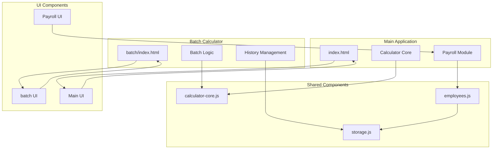
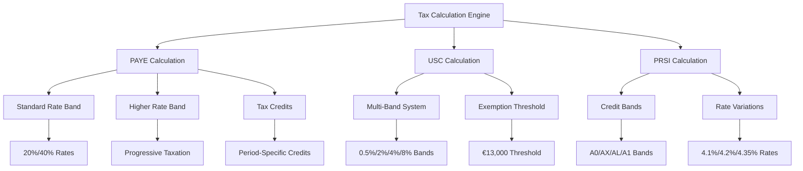
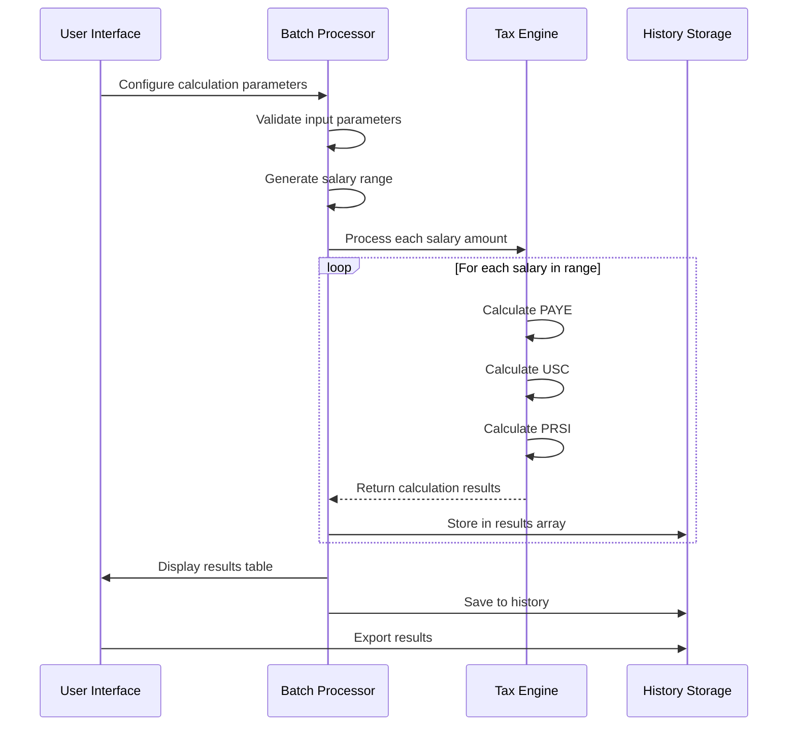
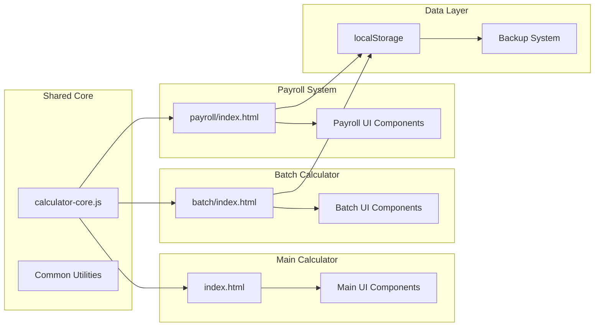
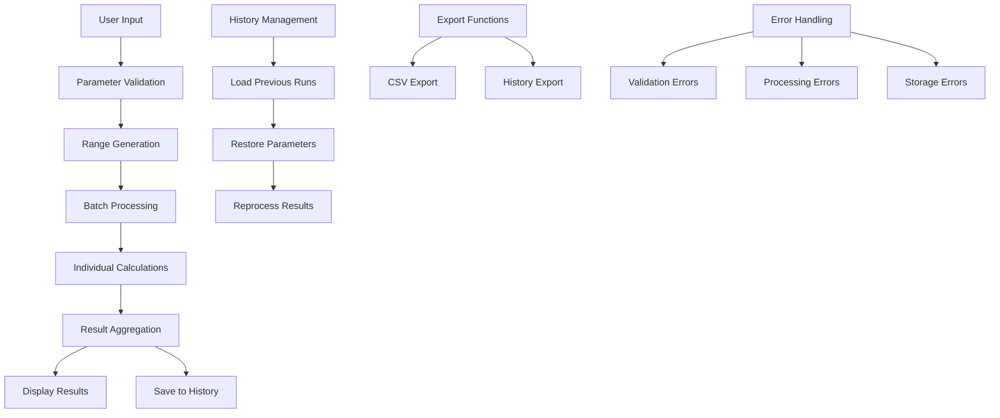
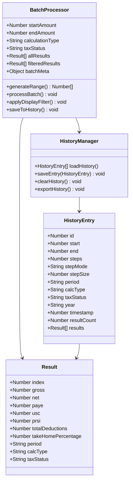
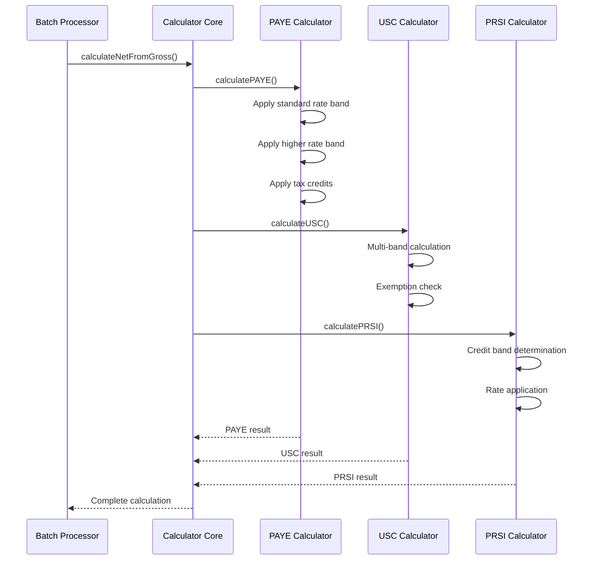
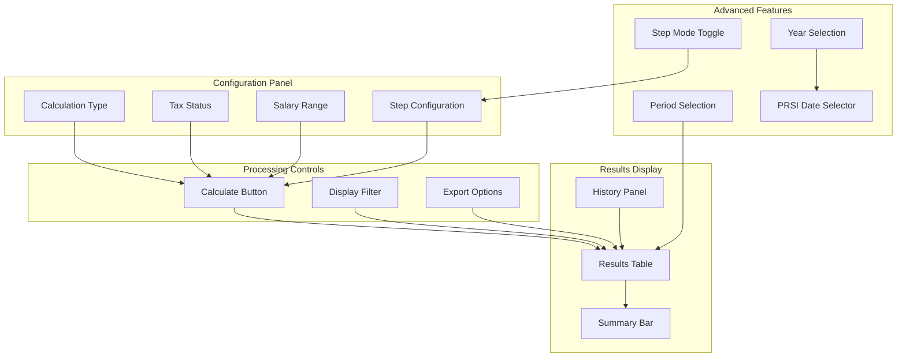
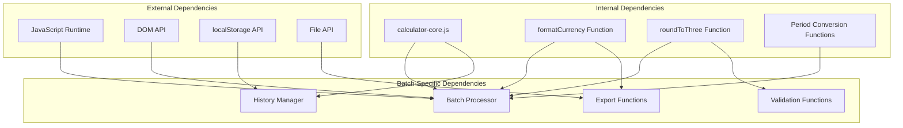
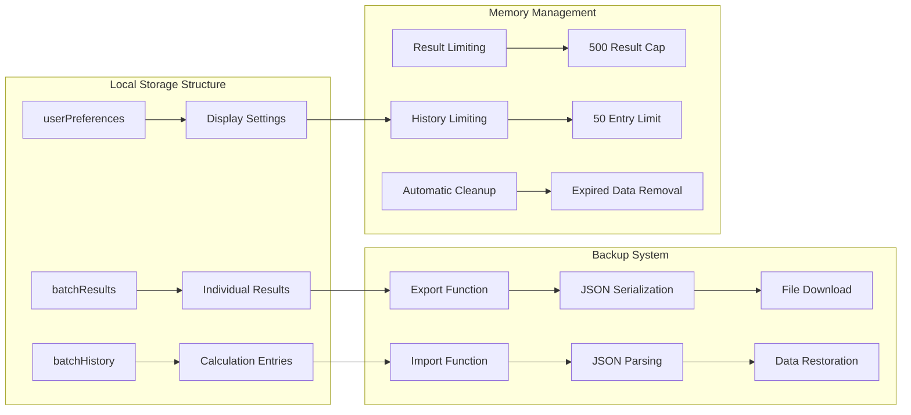

# Batch Calculator

<cite>
**Referenced Files in This Document**
- [batch/index.html](file://batch/index.html)
- [js/calculator-core.js](file://js/calculator-core.js)
- [payroll/index.html](file://payroll/index.html)
- [payroll/payroll.js](file://payroll/payroll.js)
- [payroll/employees.js](file://payroll/employees.js)
- [payroll/storage.js](file://payroll/storage.js)
- [README.md](file://README.md)
</cite>

## Table of Contents
1. [Introduction](#introduction)
2. [Project Structure](#project-structure)
3. [Core Components](#core-components)
4. [Architecture Overview](#architecture-overview)
5. [Detailed Component Analysis](#detailed-component-analysis)
6. [Dependency Analysis](#dependency-analysis)
7. [Performance Considerations](#performance-considerations)
8. [Troubleshooting Guide](#troubleshooting-guide)
9. [Conclusion](#conclusion)

## Introduction
The Batch Calculator is a specialized component of the Irish Payroll Calculator suite designed to perform bulk salary calculations across configurable ranges and parameters. It extends the core tax calculation engine to support automated batch processing, comprehensive result visualization, and persistent history management for payroll analysis and reporting.

This system enables users to calculate multiple salary scenarios simultaneously, providing detailed breakdowns of PAYE, USC, and PRSI calculations across various tax years and pay frequencies. The batch calculator serves as a powerful analytical tool for payroll professionals, financial analysts, and anyone needing to evaluate salary structures across different income brackets.

## Project Structure
The Batch Calculator operates as a standalone module within the broader Irish Payroll Calculator ecosystem. The project follows a modular architecture with clear separation between core calculation logic, user interface components, and data persistence layers.

**Diagram sources**
- [batch/index.html:1-1348](file://batch/index.html#L1-L1348)
- [js/calculator-core.js:1-597](file://js/calculator-core.js#L1-L597)
- [payroll/index.html:1-182](file://payroll/index.html#L1-L182)

**Section sources**
- [batch/index.html:1-1348](file://batch/index.html#L1-L1348)
- [js/calculator-core.js:1-597](file://js/calculator-core.js#L1-L597)
- [README.md:1-226](file://README.md#L1-L226)

## Core Components

### Tax Calculation Engine
The batch calculator leverages a sophisticated tax calculation engine that handles PAYE, USC, and PRSI computations with precision. The core engine supports multiple tax years (2024-2026) and includes advanced features like tapered PRSI credits and period-specific calculations.

**Diagram sources**
- [js/calculator-core.js:151-575](file://js/calculator-core.js#L151-L575)

### Batch Processing Architecture
The batch processing system is designed to handle large-scale calculations efficiently while maintaining accuracy and performance. It supports both step-count and step-size modes for flexible range generation.

**Diagram sources**
- [batch/index.html:956-1060](file://batch/index.html#L956-L1060)
- [js/calculator-core.js:514-575](file://js/calculator-core.js#L514-L575)

**Section sources**
- [js/calculator-core.js:8-118](file://js/calculator-core.js#L8-L118)
- [batch/index.html:807-1348](file://batch/index.html#L807-L1348)

## Architecture Overview

### System Integration
The batch calculator integrates seamlessly with the main calculator application and the payroll management system through shared core components and standardized data formats.

**Diagram sources**
- [batch/index.html:797-798](file://batch/index.html#L797-L798)
- [payroll/index.html:168-171](file://payroll/index.html#L168-L171)
- [js/calculator-core.js:1-5](file://js/calculator-core.js#L1-L5)

### Data Flow Architecture
The batch calculator implements a robust data flow system that manages calculation parameters, processes tax calculations, and maintains result history with efficient memory management.

**Diagram sources**
- [batch/index.html:956-1331](file://batch/index.html#L956-L1331)
- [payroll/storage.js:348-500](file://payroll/storage.js#L348-L500)

**Section sources**
- [batch/index.html:1-1348](file://batch/index.html#L1-L1348)
- [payroll/storage.js:1-534](file://payroll/storage.js#L1-L534)

## Detailed Component Analysis

### Batch Processing Engine
The batch processing engine is the core computational component responsible for generating salary ranges, executing tax calculations, and managing result aggregation. It supports two primary calculation modes: step-count mode for fixed interval processing and step-size mode for continuous range evaluation.

**Diagram sources**
- [batch/index.html:849-1052](file://batch/index.html#L849-L1052)
- [batch/index.html:1149-1291](file://batch/index.html#L1149-L1291)

### Tax Calculation Integration
The batch calculator integrates deeply with the core tax calculation engine, utilizing shared functions for PAYE, USC, and PRSI computations while adapting them for batch processing requirements.

**Diagram sources**
- [js/calculator-core.js:514-542](file://js/calculator-core.js#L514-L542)
- [batch/index.html:1022-1046](file://batch/index.html#L1022-L1046)

### User Interface Components
The batch calculator features a comprehensive user interface designed for efficient batch processing and result visualization. The interface supports real-time parameter adjustment, dynamic result filtering, and extensive export capabilities.

**Diagram sources**
- [batch/index.html:686-791](file://batch/index.html#L686-L791)
- [batch/index.html:807-944](file://batch/index.html#L807-L944)

**Section sources**
- [batch/index.html:686-1348](file://batch/index.html#L686-L1348)
- [js/calculator-core.js:123-129](file://js/calculator-core.js#L123-L129)

## Dependency Analysis

### Core Dependencies
The batch calculator maintains minimal external dependencies while leveraging shared components from the main application. The primary dependencies include the calculator core, DOM manipulation utilities, and browser APIs.

**Diagram sources**
- [batch/index.html:797-798](file://batch/index.html#L797-L798)
- [js/calculator-core.js:578-596](file://js/calculator-core.js#L578-L596)

### Data Persistence Architecture
The batch calculator implements a sophisticated data persistence system that manages calculation history, user preferences, and export data through localStorage with backup and restore capabilities.

**Diagram sources**
- [batch/index.html:1149-1331](file://batch/index.html#L1149-L1331)
- [payroll/storage.js:348-500](file://payroll/storage.js#L348-L500)

**Section sources**
- [batch/index.html:1149-1331](file://batch/index.html#L1149-L1331)
- [payroll/storage.js:1-534](file://payroll/storage.js#L1-534)

## Performance Considerations

### Calculation Efficiency
The batch calculator is optimized for performance through several key strategies including efficient range generation, optimized calculation loops, and intelligent result caching mechanisms.

### Memory Management
The system implements strict memory management policies to prevent performance degradation during large-scale calculations. Results are processed incrementally, and memory is actively managed through result limiting and automatic cleanup mechanisms.

### Scalability Factors
The batch calculator demonstrates excellent scalability characteristics, supporting up to 500 calculation steps with optimal performance. The system architecture accommodates future scaling requirements through modular design and efficient resource utilization.

## Troubleshooting Guide

### Common Calculation Issues
The batch calculator includes comprehensive error handling for input validation, calculation failures, and data persistence issues. Users can troubleshoot most problems through the built-in validation messages and error recovery mechanisms.

### Performance Optimization
For optimal performance, users should configure appropriate step parameters, utilize the display filtering options to limit result sets, and leverage the export functions for post-processing analysis.

### Data Recovery
The backup and restore system provides robust data recovery capabilities for batch calculation history, ensuring users can recover from unexpected data loss or system failures.

**Section sources**
- [batch/index.html:946-954](file://batch/index.html#L946-L954)
- [payroll/storage.js:348-500](file://payroll/storage.js#L348-L500)

## Conclusion

The Batch Calculator represents a sophisticated addition to the Irish Payroll Calculator ecosystem, providing powerful batch processing capabilities for payroll analysis and financial planning. Its modular architecture, comprehensive feature set, and robust performance characteristics make it an invaluable tool for payroll professionals and financial analysts.

The system's integration with the core tax calculation engine ensures accuracy and consistency with official Irish tax calculations, while its user-friendly interface and extensive export capabilities facilitate efficient workflow integration. The comprehensive history management and backup systems provide reliability and data persistence essential for professional payroll operations.

Through its innovative approach to batch processing and result visualization, the Batch Calculator enhances the overall value proposition of the Irish Payroll Calculator suite, supporting both individual users seeking salary analysis and professional payroll practitioners requiring comprehensive calculation capabilities.