# Payroll Management System

<cite>
**Referenced Files in This Document**
- [index.html](file://index.html)
- [payroll/index.html](file://payroll/index.html)
- [js/calculator-core.js](file://js/calculator-core.js)
- [payroll/payroll.js](file://payroll/payroll.js)
- [payroll/employees.js](file://payroll/employees.js)
- [payroll/storage.js](file://payroll/storage.js)
- [README.md](file://README.md)
</cite>

## Table of Contents
1. [Introduction](#introduction)
2. [System Architecture](#system-architecture)
3. [Core Components](#core-components)
4. [Payroll Application](#payroll-application)
5. [Employee Management](#employee-management)
6. [Tax Calculation Engine](#tax-calculation-engine)
7. [Data Storage System](#data-storage-system)
8. [User Interface Components](#user-interface-components)
9. [Backup and Export Functionality](#backup-and-export-functionality)
10. [Integration Patterns](#integration-patterns)
11. [Performance Considerations](#performance-considerations)
12. [Security Considerations](#security-considerations)
13. [Troubleshooting Guide](#troubleshooting-guide)
14. [Conclusion](#conclusion)

## Introduction

The Payroll Management System is a comprehensive Irish payroll calculation and management solution designed for small businesses and payroll professionals. This system provides accurate tax calculations for PAYE (Pay Related Income Tax), USC (Universal Social Charge), and PRSI (Pay Related Social Insurance) with support for multiple tax years (2024-2026) and various pay frequencies (weekly, fortnightly, monthly, annual).

The system consists of two primary interfaces: a public-facing salary calculator for individuals and a comprehensive payroll management application for businesses. Both systems share a common tax calculation engine while providing distinct user experiences tailored to their respective audiences.

## System Architecture

The Payroll Management System follows a modular architecture with clear separation of concerns between presentation, business logic, and data persistence layers.

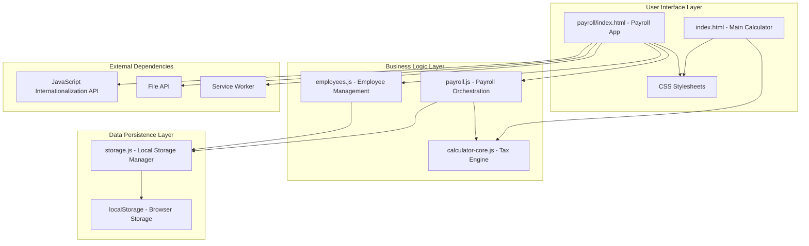

**Diagram sources**
- [index.html:1-800](file://index.html#L1-L800)
- [payroll/index.html:1-182](file://payroll/index.html#L1-L182)
- [js/calculator-core.js:1-597](file://js/calculator-core.js#L1-L597)
- [payroll/payroll.js:1-800](file://payroll/payroll.js#L1-L800)
- [payroll/employees.js:1-800](file://payroll/employees.js#L1-L800)
- [payroll/storage.js:1-534](file://payroll/storage.js#L1-L534)

## Core Components

### Tax Calculation Engine

The tax calculation engine serves as the foundation for all payroll computations, providing accurate calculations for Irish tax components with support for multiple tax years and scenarios.

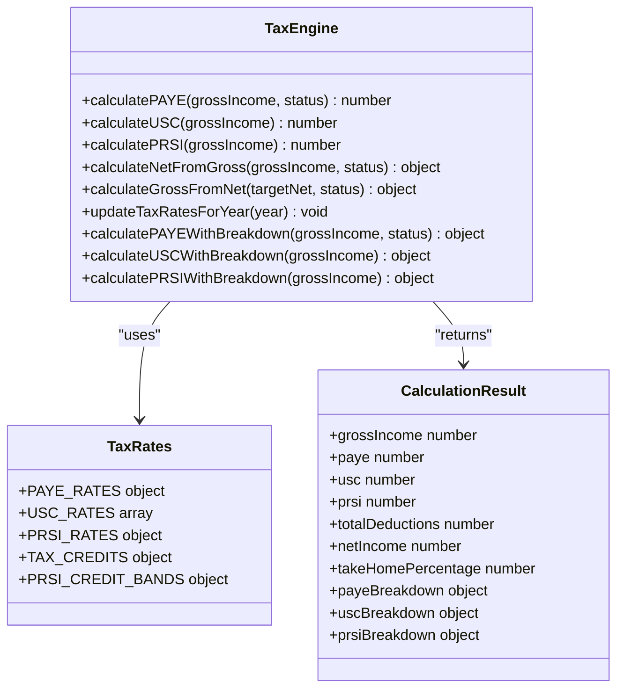

**Diagram sources**
- [js/calculator-core.js:151-542](file://js/calculator-core.js#L151-L542)

**Section sources**
- [js/calculator-core.js:8-118](file://js/calculator-core.js#L8-L118)
- [js/calculator-core.js:123-129](file://js/calculator-core.js#L123-L129)
- [js/calculator-core.js:514-542](file://js/calculator-core.js#L514-L542)

### Multi-Year Tax Rate Management

The system maintains comprehensive tax rate configurations for multiple Irish tax years, ensuring accurate calculations across different legislative periods.

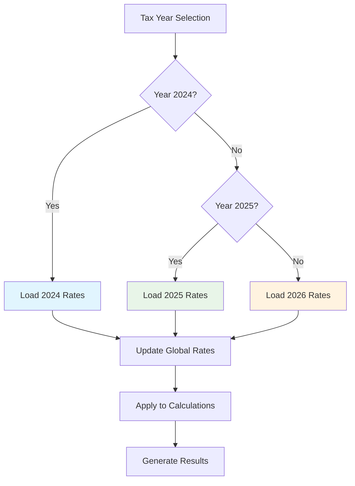

**Diagram sources**
- [js/calculator-core.js:9-118](file://js/calculator-core.js#L9-L118)
- [js/calculator-core.js:123-129](file://js/calculator-core.js#L123-L129)

**Section sources**
- [js/calculator-core.js:9-118](file://js/calculator-core.js#L9-L118)

## Payroll Application

The payroll application provides a comprehensive interface for managing multiple companies, employees, and payroll runs with advanced features for business payroll management.

### Company Management System

The application supports multi-company functionality with separate workspaces for different business entities, each maintaining their own employee lists and payroll history.

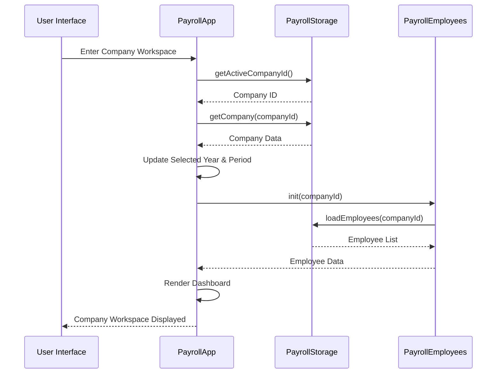

**Diagram sources**
- [payroll/payroll.js:237-282](file://payroll/payroll.js#L237-L282)
- [payroll/employees.js:86-89](file://payroll/employees.js#L86-L89)

**Section sources**
- [payroll/payroll.js:78-132](file://payroll/payroll.js#L78-L132)
- [payroll/payroll.js:237-282](file://payroll/payroll.js#L237-L282)

### Payroll Run Management

The payroll run system enables comprehensive payroll processing with real-time calculations, validation, and detailed reporting capabilities.

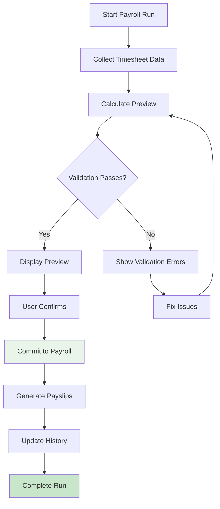

**Diagram sources**
- [payroll/payroll.js:326-472](file://payroll/payroll.js#L326-L472)
- [payroll/payroll.js:814-921](file://payroll/payroll.js#L814-L921)

**Section sources**
- [payroll/payroll.js:508-567](file://payroll/payroll.js#L508-L567)
- [payroll/payroll.js:814-921](file://payroll/payroll.js#L814-L921)

### Payslip Generation System

The system generates detailed payslips with comprehensive calculation breakdowns, supporting both hourly and salaried employees with full transparency of tax deductions.

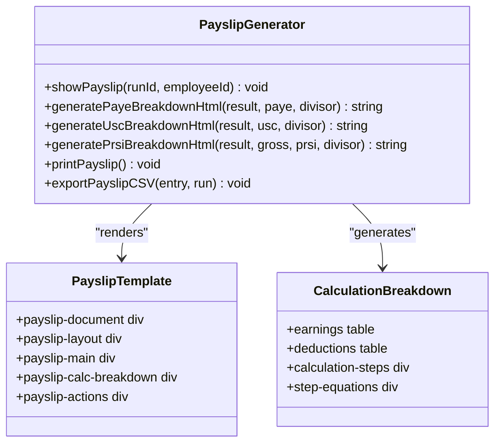

**Diagram sources**
- [payroll/payroll.js:1054-1390](file://payroll/payroll.js#L1054-L1390)

**Section sources**
- [payroll/payroll.js:1054-1390](file://payroll/payroll.js#L1054-L1390)

## Employee Management

The employee management module provides comprehensive functionality for maintaining employee records, including personal information, tax status, pay type, and payroll history tracking.

### Employee Data Model

Each employee record maintains extensive information for accurate payroll calculations and compliance reporting.

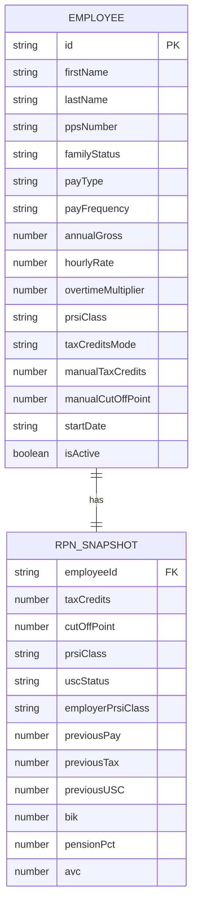

**Diagram sources**
- [payroll/employees.js:149-626](file://payroll/employees.js#L149-L626)

**Section sources**
- [payroll/employees.js:149-626](file://payroll/employees.js#L149-L626)

### Tax Credits and Cut-Off Points Tracking

The system tracks tax credits and cut-off points on a cumulative basis across payroll periods, ensuring compliance with Irish Revenue requirements.

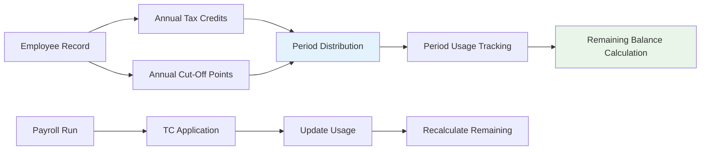

**Diagram sources**
- [payroll/payroll.js:1515-1622](file://payroll/payroll.js#L1515-L1622)

**Section sources**
- [payroll/payroll.js:1515-1622](file://payroll/payroll.js#L1515-L1622)

## Tax Calculation Engine

The tax calculation engine provides precise calculations for Irish tax components with detailed breakdowns and support for multiple calculation scenarios.

### PAYE Calculation Logic

The PAYE calculation engine implements the standard and higher rate tax bands with appropriate cut-off points for different family statuses.

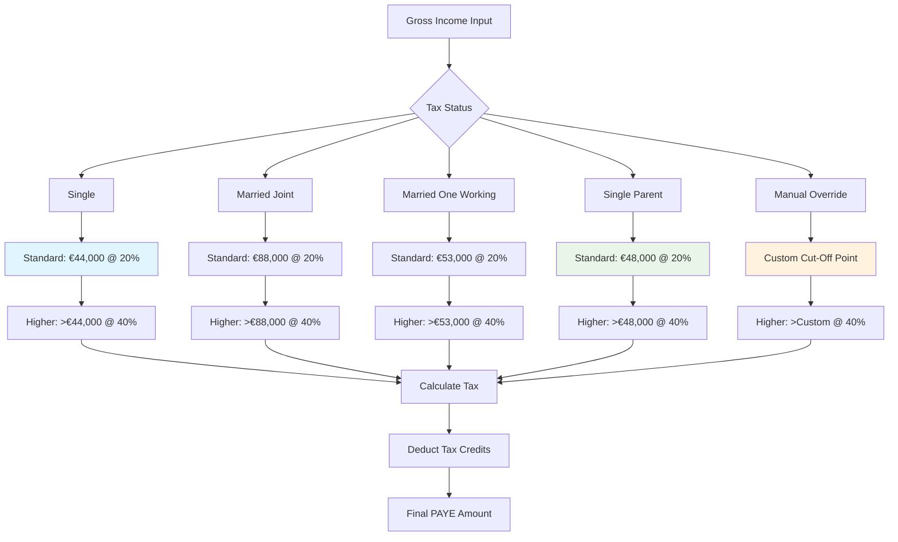

**Diagram sources**
- [js/calculator-core.js:151-178](file://js/calculator-core.js#L151-L178)
- [js/calculator-core.js:396-492](file://js/calculator-core.js#L396-L492)

**Section sources**
- [js/calculator-core.js:151-178](file://js/calculator-core.js#L151-L178)
- [js/calculator-core.js:396-492](file://js/calculator-core.js#L396-L492)

### USC Calculation Implementation

The USC calculation follows the multi-tier band structure with specific rates for different income brackets.

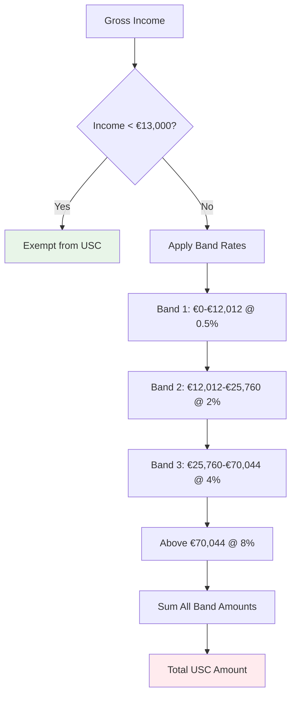

**Diagram sources**
- [js/calculator-core.js:180-197](file://js/calculator-core.js#L180-L197)
- [js/calculator-core.js:199-237](file://js/calculator-core.js#L199-L237)

**Section sources**
- [js/calculator-core.js:180-197](file://js/calculator-core.js#L180-L197)
- [js/calculator-core.js:199-237](file://js/calculator-core.js#L199-L237)

### PRSI Calculation with Credit System

The PRSI calculation incorporates a sophisticated credit system with different bands and tapering mechanisms.

```mermaid
flowchart TD
A[Period Gross Income] --> B{Below A0 Threshold?}
B --> |Yes| C[No Employee PRSI]
B --> |No| D{Within AX Band?}
D --> |Yes| E[Apply Tapered Credit Formula]
D --> |No| F{Within AL Band?}
F --> |Yes| G[Standard Rate PRSI]
F --> |No| H[Standard Rate PRSI (A1)]
E --> I[Calculate Net PRSI]
G --> I
H --> I
I --> J[Apply Period Multiplier]
J --> K[Annualized PRSI]
style C fill:#e8f5e8
style I fill:#fff3e0
style K fill:#ffebee
```

**Diagram sources**
- [js/calculator-core.js:244-394](file://js/calculator-core.js#L244-L394)

**Section sources**
- [js/calculator-core.js:244-394](file://js/calculator-core.js#L244-L394)

## Data Storage System

The data storage system utilizes browser localStorage for persistent data management across multiple companies and payroll runs.

### Multi-Company Data Architecture

The storage system supports up to three companies with separate data isolation and unified backup functionality.

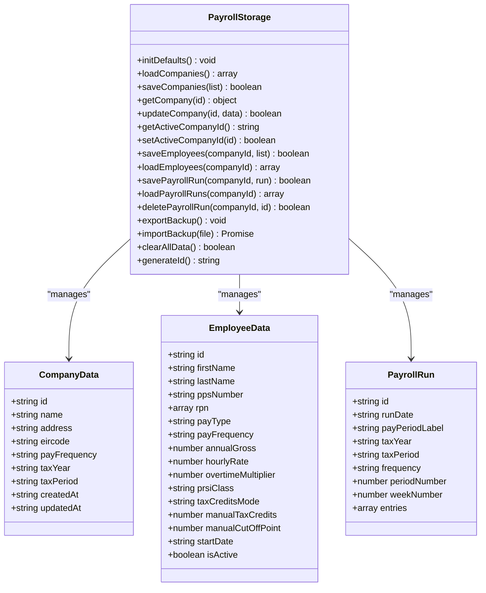

**Diagram sources**
- [payroll/storage.js:6-534](file://payroll/storage.js#L6-L534)

**Section sources**
- [payroll/storage.js:6-534](file://payroll/storage.js#L6-L534)

### Backup and Restore Functionality

The system provides comprehensive backup and restore capabilities for data portability and disaster recovery.

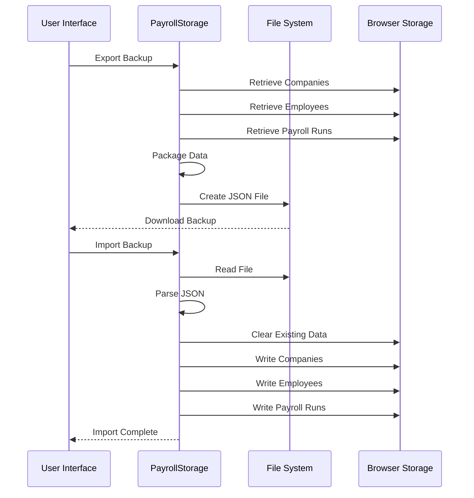

**Diagram sources**
- [payroll/storage.js:348-500](file://payroll/storage.js#L348-L500)

**Section sources**
- [payroll/storage.js:348-500](file://payroll/storage.js#L348-L500)

## User Interface Components

The user interface provides intuitive, responsive design with tabbed navigation and comprehensive form controls for payroll management.

### Tabbed Interface Architecture

The application uses a tabbed interface pattern for organizing different functional areas within the payroll workspace.

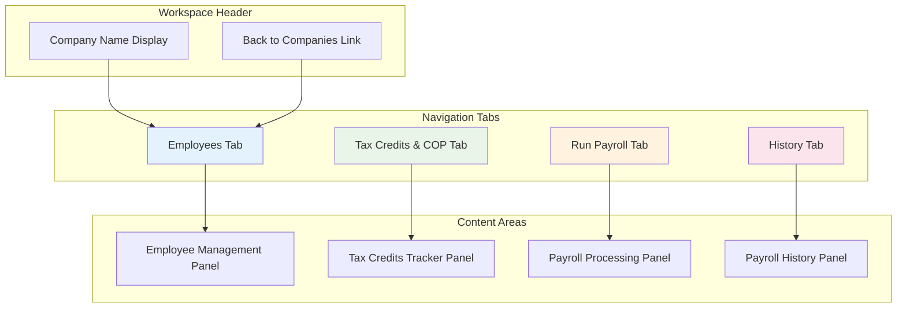

**Diagram sources**
- [payroll/index.html:28-33](file://payroll/index.html#L28-L33)
- [payroll/index.html:54-58](file://payroll/index.html#L54-L58)

**Section sources**
- [payroll/index.html:28-33](file://payroll/index.html#L28-L33)
- [payroll/index.html:54-58](file://payroll/index.html#L54-L58)

### Form Validation and Error Handling

The system implements comprehensive form validation with real-time feedback and error messaging.

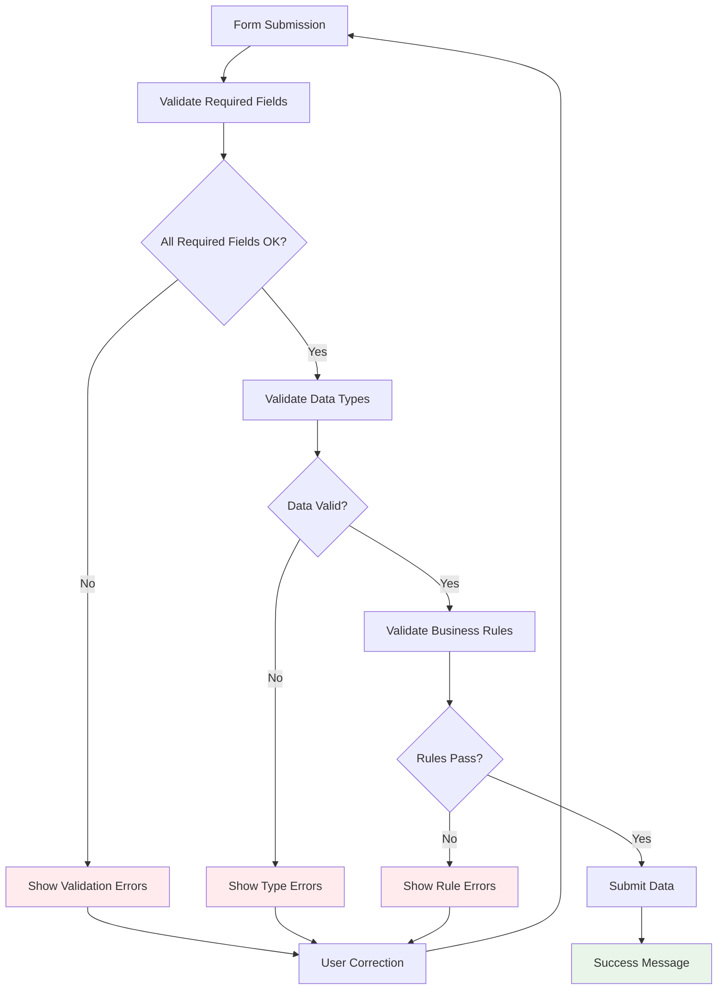

**Diagram sources**
- [payroll/employees.js:629-711](file://payroll/employees.js#L629-L711)

**Section sources**
- [payroll/employees.js:629-711](file://payroll/employees.js#L629-L711)

## Backup and Export Functionality

The system provides robust backup and export capabilities for data portability and compliance requirements.

### Export Formats

The system supports multiple export formats including CSV, Excel, and JSON for different use cases and integration needs.

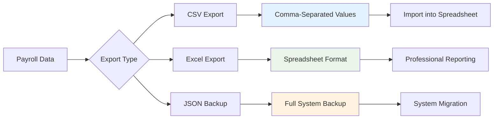

**Diagram sources**
- [payroll/payroll.js:1397-1481](file://payroll/payroll.js#L1397-L1481)
- [payroll/storage.js:348-382](file://payroll/storage.js#L348-L382)

**Section sources**
- [payroll/payroll.js:1397-1481](file://payroll/payroll.js#L1397-L1481)
- [payroll/storage.js:348-382](file://payroll/storage.js#L348-L382)

## Integration Patterns

The system employs several integration patterns to maintain clean separation of concerns and enable extensibility.

### Module Pattern Implementation

Each major component follows the module pattern for encapsulation and dependency management.

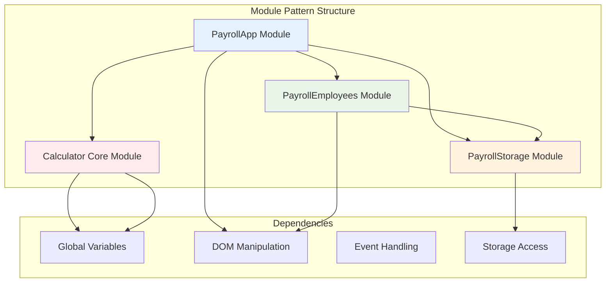

**Diagram sources**
- [payroll/payroll.js:4-1931](file://payroll/payroll.js#L4-L1931)
- [payroll/employees.js:4-800](file://payroll/employees.js#L4-L800)
- [payroll/storage.js:6-534](file://payroll/storage.js#L6-L534)

**Section sources**
- [payroll/payroll.js:4-1931](file://payroll/payroll.js#L4-L1931)
- [payroll/employees.js:4-800](file://payroll/employees.js#L4-L800)
- [payroll/storage.js:6-534](file://payroll/storage.js#L6-L534)

## Performance Considerations

The system is optimized for performance through efficient data structures, lazy loading, and minimal DOM manipulation.

### Calculation Performance

Tax calculations are optimized for speed while maintaining accuracy through efficient algorithmic approaches.

### Memory Management

The system implements proper memory management with event listener cleanup and DOM element removal to prevent memory leaks.

### Storage Optimization

Data is stored efficiently using JSON serialization and organized key structures to minimize storage overhead and improve access times.

## Security Considerations

The system implements several security measures to protect sensitive payroll data.

### Data Validation

All user inputs are validated both on the client-side and server-side to prevent injection attacks and ensure data integrity.

### Secure Data Handling

Payroll data is stored locally in the browser using secure storage mechanisms and is not transmitted to external servers.

### Privacy Protection

The system does not collect personal data beyond what is necessary for payroll calculations and provides users with full control over their data.

## Troubleshooting Guide

Common issues and their solutions for the Payroll Management System.

### Data Import/Export Issues

**Problem**: Backup import fails with validation errors
**Solution**: Verify the backup file format matches the expected schema and check for corrupted data

**Problem**: Exported CSV files not opening properly
**Solution**: Ensure the file has the correct .csv extension and try opening with a spreadsheet application

### Calculation Errors

**Problem**: Incorrect tax calculations for specific scenarios
**Solution**: Verify the selected tax year and family status match the employee's circumstances

**Problem**: Payslip generation fails for certain employees
**Solution**: Check employee data completeness and ensure all required fields are populated

### Performance Issues

**Problem**: Slow response times with large datasets
**Solution**: Clear browser cache, reduce the number of active employees, or consider upgrading device hardware

### Browser Compatibility

**Problem**: Features not working in older browsers
**Solution**: Use supported browsers or update to the latest version of your current browser

## Conclusion

The Payroll Management System provides a comprehensive, accurate, and user-friendly solution for Irish payroll calculations and management. The system's modular architecture, robust data persistence, and comprehensive feature set make it suitable for both individual use and small business payroll management.

Key strengths of the system include its accurate tax calculations aligned with current Irish Revenue requirements, comprehensive payslip generation with detailed breakdowns, multi-company support, and robust backup and export functionality. The clean separation of concerns and well-structured codebase facilitate maintenance and future enhancements.

The system successfully balances functionality with usability, providing both automated calculations for quick results and detailed breakdowns for educational and professional use. Its compliance with Irish tax regulations and support for multiple calculation scenarios make it a reliable tool for payroll professionals and individuals alike.